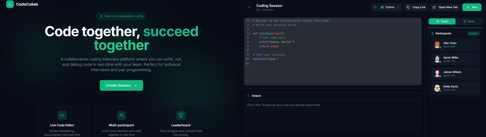

# Code Collab Studio

An end-to-end collaborative coding platform built for the **DataTalksClub AI Dev Tools Zoomcamp**.



This project provides a real-time coding environment where users can edit code together, visualize results, and execute code safely in the browser.

## Features

- **Real-time Collaboration**: Multiple users can edit code simultaneously in a shared session.
- **Syntax Highlighting**: Supports JavaScript and Python with specific syntax highlighting.
- **Safe Code Execution**:
  - **Python**:Executed entirely in the browser using [Pyodide](https://pyodide.org/) (WASM), ensuring no server-side risks.
  - **JavaScript**: Executed in isolated Web Workers to prevent main thread blocking and ensure security.
- **Containerization**: Fully Dockerized application combining both frontend (static assets) and backend (FastAPI).

## Tech Stack

- **Frontend**: React, Vite, TailwindCSS, Shadcn UI.
- **Backend**: Python, FastAPI.
- **Editor**: CodeMirror (via `@uiw/react-codemirror`).
- **Tools**: Docker, UV (Python package manager), Concurrently.

## Getting Started

### Prerequisites

- Node.js 20+
- Python 3.12+
- [uv](https://github.com/astral-sh/uv) (for backend dependency management)

### Installation

1.  **Clone the repository:**
    ```bash
    git clone <repository-url>
    cd code-collab-studio
    ```

2.  **Install dependencies:**
    ```bash
    # Install frontend dependencies
    cd frontend
    npm install

    # Install backend dependencies
    cd ../backend
    uv sync
    ```

### Running the Application

To run both the frontend and backend servers simultaneously:

```bash
# From the root directory
npm run dev
```

This command uses `concurrently` to start:
- Frontend: `http://localhost:5173`
- Backend: `http://localhost:8000`

## Testing

We use `pytest` for the backend and `vitest` for the frontend.

### Backend Tests
Integration and unit tests verify the API endpoints and websocket connections.

```bash
# Run all backend tests
uv run pytest

# Run quietly
uv run pytest -q
```

### Frontend Tests
Tests cover the execution logic and component rendering.

```bash
cd frontend
npm test
```

To verify the code execution logic explicitly:
```bash
cd frontend
npm test -- src/lib/executor.test.ts
```

## Docker & Deployment

The application is containerized into a single image that serves the built frontend statically via FastAPI.

### Build and Run with Docker

1.  **Build the image:**
    ```bash
    docker build -t code-collab-studio .
    ```

2.  **Run the container:**
    ```bash
    docker run -p 8000:8000 code-collab-studio
    ```
    Access the app at `http://localhost:8000`.

### Using Docker Compose

For a more robust setup or development:

```bash
docker-compose up --build
```

## Implementation Details for Homework

- **Q1: Initial Implementation**: The app was structured effectively splitting frontend and backend responsibilities.
- **Q2: Tests**: Integration tests were added early to ensure client-server communication stability.
- **Q3: Concurrent Execution**: `concurrently` is used in the root `package.json` to streamline the dev experience.
- **Q4: Syntax Highlighting**: Implemented using `@uiw/react-codemirror` with language extensions for Python and JavaScript.
- **Q5: Code Execution**: 
  - Python runs via Pyodide (WASM).
  - JavaScript runs via Web Workers.
- **Q6: Containerization**: A multi-stage Dockerfile builds the React frontend and copies the assets to the Python backend image (`python:3.12-slim`).
- **Q7: Deployment**: The Docker container is ready for deployment on any container runtime (e.g., Render, Railway, AWS App Runner).
